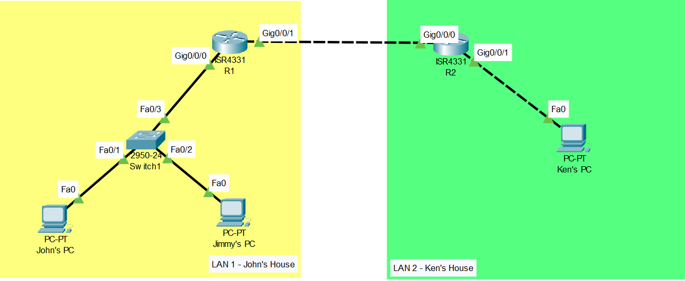

Knowing your network components 
 

Ok first of all it is very important that we all understand the very basic 
network components that exists in a network. Below are the components that exists in the diagram above: 
1.	End Devices
 

Here is what we call an “End Device” because it is either the source or destination 
of the data that is sent over the network. Sometimes referred to as “Host”. Like our 
human names to uniquely identify ourselves, they too have an unique identifier on the 
network which is called Internet Protocol (IP). End devices does not only consist of 
computers but any electronic devices that is capable of accessing the network. Do note 
that Internet and network are not the same thing ! In simple, Internet is an extremely 
large network and the word network just means a connection between 2 or more devices 
that enables internal communication. 

2.	Switches
 

These devices are called the intermediary devices which connects the end devices 
to the network. Intermediary devices also contain many other devices such as 
wireless router, LAN switches, normal router, layer 3 switches, and etc. They are 
responsible for forwarding frames within the local network. Frames are encapsulated data. 
3.	Router 
 

Routers are also an intermediary device that forwards frames specifically to other 
networks instead of local network. They are the boundaries for each network which 
will be responsible for connecting the end devices on its local network to other 
networks. This action is called routing packets. They have additional features 
such as built-in firewalls, DHCP (Dynamic Host Configuration Protocols), 
DNS (Domain Name Service), NAT (Network Address Translation), and many other services.  

4.	Cables 
 

There are many cables that exist in the networking world but in this case we can 
see that there are two different types of cable shown which is copper straight 
over (The not dotted cable) and the copper cross over (The dotted one). They 
are responsible for connecting network devices and each of them exists for a 
reason. Straight over cables are used to connect devices that are different 
like IP capable devices to non-IP capable devices, while crossover is used to 
connect two same devices (IP – IP devices or NonIP to NonIP devices). This is 
because their pins in their socket, you cannot connect transmitting pins at 
both of the end devices and expect them to receive because both receiving pins
are also connected together; therefore, you will need to make 
transmit -> receive and receive -> transmit 
happen when connecting the devices. 
Read more : https://networkengineering.stackexchange.com/questions/34425/why-do-i-need-a-crossover-cable-to-connect-devices-of-the-same-type

Other components

5.	Hubs
Hubs are also intermediary devices but it could be called as the “dumb” device 
among the intermediary device. Your typical hub looks like a switch and maybe 
at a size of a home router. It’s only purpose is to amplify your frames, or simply 
your data to other port. May consist of many ports, will receive frame and just 
straight forward out other ports no matter what, no checking no processing. 

6.	NIC
Network Interface Controller is a component that any network device must have 
in order to connect to any network, not necessary to connect wireless network 
but also wired network.

7.	Types of Network

PAN (Personal Area Network):
    •	A very small network, usually just a few feet wide.
    •	Connects personal devices like smartphones, tablets, and laptops.
    •	Example: Bluetooth connections between your phone and wireless earbuds.
LAN (Local Area Network):
    •	A network that covers a small area, like a single building or a home.
    •	Connects computers and devices within this small area.
    •	Example: The Wi-Fi network in your home or office.
MAN (Metropolitan Area Network):
    •	A network that covers a city or a large campus.
    •	Connects multiple LANs within this larger area.
    •	Example: A city's public Wi-Fi network or a university's campus network.
WAN (Wide Area Network):
    •	A network that covers a very large area, like a country or even the world.
    •	Connects multiple LANs and MANs over long distances.
    •	Example: The internet.

8.	Intranet and Extranet 
Intranet:
    •	A private network used within an organization.
    •	Only accessible by the organization's employees.
    •	Example: A company's internal website where employees can access HR policies, announcements, and other internal resources.
Extranet:
    •	A private network that allows controlled access from outside the organization.
    •	Accessible by trusted partners, suppliers, or customers.
    •	Example: A supplier portal where vendors can log in to manage orders and inventory.

